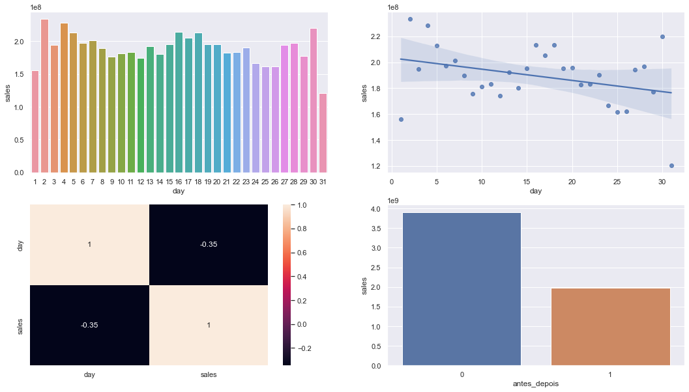
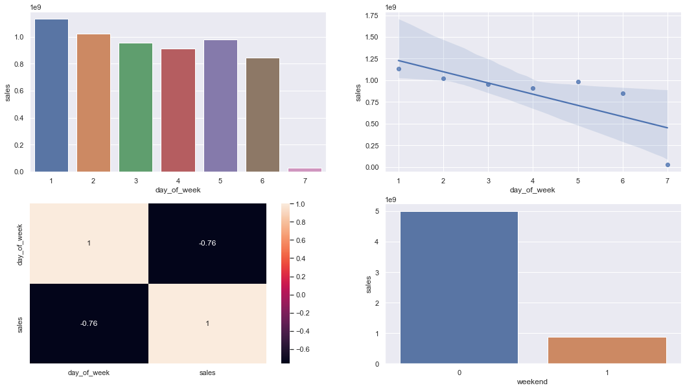

# Rossmann Store Sales Prediction

 

# Questão de Negócio

A Rossmann, é uma rede de varejo farmacêutico estabelecida em 1972 em Hanover, Alemanha. Todos os meses é realizado uma reunião com todos os gerentes de lojas para apresentação de resultados.
Na reunião do último mês o CFO (Chief Financial Officer) solicitou aos gerentes que fizessem a predição das vendas de suas respectivas lojas para as próximas seis semanas. Essa solicitação tem como objetivo a destinação de parte do faturamento ser destinado para reforma das lojas. A partir disso, iniciamos o planejamento da solução para auxiliar os gerentes nesta entrega.

Os dados são provenientes da competição do Kaggle disponível [clicando aqui](https://www.kaggle.com/c/rossmann-store-sales/data).

 

# Objetivo do projeto

Fazer a previsão de vendas para as próximas 6 semanas das 1.115 lojas disponíveis no dataset

 

# Premissas de negócio

Foi realizado o levantamento de algumas premissas que o projeto precisa atender:

1. O CFO deve ter acesso às previsões de qualquer lugar.
2. O CFO precisa ter liberdade para analisar caso a caso.
3. Os dias em que as lojas estiveram fechadas serão excluídos da previsão.
4. A previsão considerará apenas as lojas que tiveram vendas superiores a 0 nos dados disponíveis.
5. A equipe definiu algumas metas financeiras a serem cumpridas para identificar se o estabelecimento pode ou não ser reformado e qual é o limite máximo do budget:
    1. Se a média do faturamento previsto for menor do que a média das faturamento, então não podemos fazer a reforma; caso contrário podemos fazer a reforma.
    2.  Se a diferença do faturamento previsto for menor do que 2,5%, pode-se utilizar 7,5% do faturamento total para a reforma. Se estiver entre 2,5% e 5%, utiliza-se 10%; se for superior a 5%, utiliza-se 12,5% do faturamento.

 

#  Descrição dos dados

As variáveis originais do conjunto de dados são: 

Variável | Definição
------------ | -------------
Store | identificador único da loja|
DayOfWeek | dia da semana (1 = segunda-feira / 7 = domingo)|
Sales | vendas/dia (objetivo)|
Customers | número de clientes no dia.|
Open | indica se a loja está aberta ou fechada (1 = aberta / 0 = fechada)|
Promo | se existe uma promoção no dia ( 1 indica que estava ocorrendo uma promoção nesta loja)|
StateHoliday | indica um feriado estadual (a = feriado público / b = feriado da páscoa / c = natal / 0 = nenhum tipo de feriado neste dia)|
SchoolHoliday | feriado escolar (1 = feriado escolar / 0 = não é feriado escolar)|
Store | identificador único da loja.|
StoreType | tipo da loja, diferencia entre 4 modelos de loja diferentes: a, b, c, d|
Assortment | descreve um nível de sortimento (a = básico / b = extra / c = estendido)|
CompetitionDistance | distância da loja do concorrente mais próxima.|
CompetitionOpenSinceMonth | fornece o mês aproximado em que o concorrente mais próximo foi aberto.|
CompetitionOpenSinceYear | fornece o ano aproximado em que o concorrente mais próximo foi aberto.|
Promo2 | Promo2 é uma promoção adicional para todas as lojas ( 0 = a loja não está participando / 1 = a loja está articipando)|
Promo2SinceWeek | descreve a semana do calendário em que a loja começou a participar do Promo2.|
Promo2SinceYear | descreve o ano do calendário em que a loja começou a participar do Promo2.|
PromoInterval | descreve os intervalos consecutivos em que a Promo2 é iniciada, nomeando os meses. Por exemplo, "fevereiro, maio, agosto, novembro" significa que cada rodada começa em fevereiro, maio, agosto, novembro de qualquer ano para essa loja.|

 

# Planejamento da Solução

O planejamento da solução para este projeto se baseia no método CRISP-DM (Cross Industry Standard Process for Data Mining), que é uma metodologia cíclica e flexivel voltada para resolução de problemas que envolvem grande volume de dados que permite a entrega rápida de valor para os times de negócio.

Abaixo uma breve ilustração das principais etapas desse processo:

 

 

# Análise dos dados

Após a limpeza e o tratamento inicial dos dados. Foi realizado uma análise estatística da qual houve o desenvolvimento de novas features e levantamento de hipóteses de negócio.

# Insights de Negócio
Foram levantadas, respondidas e aplicada um grau de relevância para o negócio em 12 hipóteses conforme quadro a baixo:

 

| Hipótese | Pergunta | Resultato | Relevancia |
| -------- | --- | --------- | --------- |
| H1 | Lojas com maior sortimento deveriam vender mais. | FALSA | BAIXA |
| H2 | Lojas com competidores mais próximos deveriam vender menos. | FALSA | MEDIA |
| H3 | Lojas com competidores a mais tempo vender mais. | FALSA | MEDIA |
| H4 | Lojas com promoção ativa por mais tempo deveriam vender mais. | FALSA | BAIXA |
| H5 | <s>Lojas com mais dias de promoção deveriam vender mais.</s> | --- | ---  |
| H6 | Lojas com mais promoções consecultivas deveriam vender mais. | FALSA | BAIXA |
| H7 | Lojas abertas durante o feriado de Natal deveriam vender mais. | FALSA | MEDIA |
| H8 | Lojas deveriam vender mais ao longo dos anos. | FALSA | ALTA |
| H9 | Lojas deveriam vender mais no segundo semestre do ano. | FALSA | ALTA |
| H10 | Lojas deveriam vender mais depois do dia 10 de cada mês. | FALSO | ALTA |
| H11 | Lojas deveriam vender menos aos finais de semana. | VERDADEIRA | ALTA |
| H12 | Lojas deveriam vender menos durante os feriados escolares. | VERDADEIRA | BAIXA |

 

Irei destacar somente as 2 hipóteses com maior impacto no negócio.

### H10. Lojas deveriam vender mais depois do dia 10 de cada mês.
Hipótese Falsa. Percebe-se que há um decréscimo nas vendas após o dia 10. E a distribuição de vendas ao longo do mês a caba sendo bem estável com um leve declínio durante todo o mês.

### H11. Lojas deveriam vender menos aos finais de semana.
Hipótese Verdadeira. Realmente no final de semana há uma diminuição abrupta nas vendas, parte disso deve-se ao fato do Domingo ter um movimento comercial muito baixo.

# Modelos de Machine Learning

1. Average Model
2. Linear Regressor
3. Linear Regressor Regularizaded (Lasso)
4. Random Forest Regressor
5. XGBoost Regressor

 

| Index | Model Name | MAE | MAPE | RMSE |
| ----- | ---------- | --- | ---- | ---- |
| 1 | Average Model | 1354.84 | 0.46 | 1835.02 |
| 2 | Linear Regression | 1867.09 | 0.29 | 2671.05 |
| 3 | Linear Regression - Lasso | 1891.70 | 0.29 | 2744.45 |
| 4 | Random Forest Regressor | 679.60 | 0.10 | 1011.12 |
| 5 | XGBRegressor | 	883.72 | 0.13 | 1274.23 |

 

# Performance dos Modelos de Machine Learning após cross validation

Comparando o desempenho dos modelos - Cross Validation.

 

| Index | Model Name | MAE | MAPE | RMSE |
| ----- | ---------- | --- | ---- | ---- |
| 1 | Linear Regression | 2081.73 +/- 295.63 | 0.3 +/- 0.02 | 2952.52 +/- 468.37 |
| 2 | Linear Regression - Lasso | 2116.38 +/- 341.5 | 0.29 +/- 0.01 | 3057.75 +/- 504.26 |
| 3 | Random Forest Regressor | 837.68 +/- 219.1 | 0.12 +/- 0.02| 1256.08 +/- 320.36 |
| 4 | XGBRegressor | 	1030.28 +/- 167.19 | 0.14 +/- 0.02 | 1478.26 +/- 229.79 |

 

**Nota:**

- Podemos observar que o modelo Random Forest Regressor obteve uma performance melhor que todos os outros modelos.

- Observa-se que o algoritmo ‘Random Forest Regressor’ possui melhor desempenho se comparado com os demais, com uma RMSE de 1256. Haja visto que os custos envolvidos por conta da demanda computacional para manter este modelo em produção, superam os benefícios gerados neste primeiro ciclo do CRISP-DM. Optou-se por treinar o modelo final utilizando o “XGBoost Regressor”, que teve um RMSE de 1478, o que demonstra pouca diferença entre os modelos de menor RMSE.

 

# Performance do Modelo Final após fine tunning

A métrica final do modelo XGB Regresor ficou desta forma:

  

| Index | Model Name | MAE | MAPE | RMSE |
| ----- | ---------- | --- | ---- | ---- |
| 1 | XGBoost Regressor | 770.21 | 0.12 | 1108.06 |

  

Os gráficos a seguir apresentam a performance do modelo ‘XGBRegressor’:

O gráfico 1 mostra a comparação entre o valor previsto e o valor real das vendas ao longo das semanas, o que revelou uma alta fidelidade nas predições do modelo em relação aos dados reais.

O gráfico 2 exibiu a porcentagem de acerto das previsões em relação às vendas ao longo do tempo. Quando igual a um, representa uma predição precisa, ou seja, dias em que o modelo previu com exatidão as vendas. Valores acima de um indicam superestimação, enquanto valores abaixo de um apontam subestimação nas previsões de vendas.

O gráfico 3 que calcula o erro tem uma distribuição Gausiana, mais próxima de uma curva normal, isso é mais um indicador que o modelo está performando bem.

O gráfico 4 foi elaborado com o propósito de analisar a distribuição da taxa de erro na previsão de vendas em diferentes regiões. É relevante destacar que a média de erro é de 10%, porém, em alguns casos, essa porcentagem ultrapassou os 50%. 

 

 

# Resultado Negócio

Após a escolha do nosso algoritmo, somos capazes de visualizar alguns cenarios do ponto de vista de negócio.

  

Loja|Predição €|Pior cenário €|MelhorCenário €|MAE|MAPE %
| ----- | ---------- | --- | ---- | ---- |---- |
55	|	172.468,20|	171.977,62|	172.958,78|	490,58|	10,20
932	|	282.757,31|	282.148,06|	283.366,56|	609,25|	7,83
638	|	232.906,75|	232.469,60|	233.343,90|	437,15|	6,75
642	|	137.029,94|	136.461,57|	137.598,31|	568,37|	17,99

  

 **Nota:**

 - Na loja 638, a previsão é vender  232.469 euros nas próximas 6 semanas com um erro de 6,75%

  

# Conclusão

Com o modelo selecionado, treinado e avaliado com uma boa performance, chegou a hora de coloca-lo em produção. Para isso, optamos por disponibilizar as predições do projeto de forma online através do aplicativo de mensagens Telegram.

Neste aplicativo, o usuário deverá informar para um bot criado no Telegram o ID da loja a qual deseja obter a previsão de vendas nas próximas 6 semanas. Assim, o bot retornará uma mensagem com a previsão.

 

# Próximos passos

Em um próximo ciclo do CRISP, podemos analisar algumas observações feitas durante o projeto:

1. Temos uma queda nas vendas ao decorrer dos anos, que precisa ser analisado, para não afetar as vendas de 2015.
   - Mas comparando o mesmo período de meses entre 2014 e 2015 temos um aumento de 6%.

2. Registros que são outliers: 101.710.
    - Devemos depois fazer uma análise mais profunda porque nem tudo pode ser um outlier.

3. Podemos perceber que as vendas no final do mês, apresenta uma queda bem acentuada nas vendas, que precisa análisar.

4. Podemos ver que o menor pico de vendas é no domingo, esta é uma informação que precisa compreender melhor este comportamento.

5. A variável "customers" foi descartada logo no começo, pois um projeto a parte pode ser feito para integrar no projeto final
